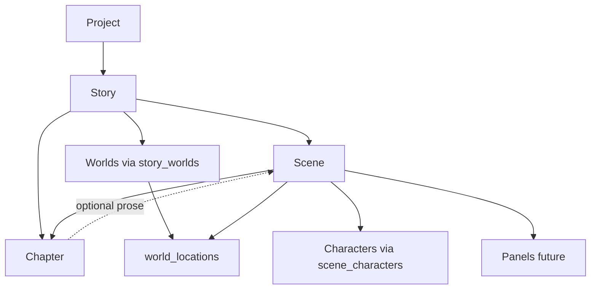

# Scene Architecture V2

**Status:** Approved for implementation  
**Date:** 2026-06-14  
**Binding directives:** [SCENE_IMPLEMENTATION_DIRECTIVES.md](./SCENE_IMPLEMENTATION_DIRECTIVES.md) — read before S1 coding  
**Supersedes:** [SCENE_ARCHITECTURE_V1.md](./SCENE_ARCHITECTURE_V1.md) (world-centric assumptions, chapter-only parent)  
**Authority:** [PROJECT_UX_PROPOSAL.md](./PROJECT_UX_PROPOSAL.md) · [FINISHED_CREATIVE_WORK_PRINCIPLE.md](./FINISHED_CREATIVE_WORK_PRINCIPLE.md) · [COLLABORATIVE_CREATION_PRINCIPLE.md](./COLLABORATIVE_CREATION_PRINCIPLE.md) · [STORY_WORKSPACE_V3_IMPLEMENTATION_REPORT.md](./STORY_WORKSPACE_V3_IMPLEMENTATION_REPORT.md)  
**Gate:** Story Workspace V3 live → Scene S1 → AI suggest S2. **Defer Project rollups.**

---

## Summary

CharID’s hierarchy is still **too world-centric**. Creators think in **stories and moments**, not database tables. **Worlds provide settings; Scenes are where stories actually happen.**

This document defines a **single Scene model** shared by comics, novels, and screenplays — with format-specific presentation on top, not separate entity types.

**One Scene answers:** *Who is here, where are they, what happens, and does it match what we already established?*

**Founder directives (summary):** Scenes are the primary storytelling object (`Project → Story → Scene`). V1 creation is four fields only. AI suggests scenes; nothing commits without approval. Story workspace stays primary; Projects stay organizational. Full rules: [SCENE_IMPLEMENTATION_DIRECTIVES.md](./SCENE_IMPLEMENTATION_DIRECTIVES.md).

---

## Implementation directives (approved)

| # | Directive | Implication |
|---|-----------|-------------|
| 1 | **Scenes = primary storytelling object** | Parent is always Story; Worlds/Locations/Characters are inputs |
| 2 | **Keep V1 simple** | Title · What happens? · Characters · Location (optional) — child &lt;30s test |
| 3 | **Scenes power AI collaboration** | Suggest next scenes from story context; Approve / Edit / Delete / Regenerate |
| 4 | **Approval model** | Suggest → Review → Edit → Approve → Commit for all AI entities |
| 5 | **Future outputs** | Same row for comic, novel, screenplay pipelines |
| 6 | **Story Workspace V3 first** | Locations, map, moodboard, bonds on story page — **shipped**; Scenes list next |
| 7 | **Projects organizational** | No worldbuilding in Project; defer Locations/Maps/Moodboards tabs |
| 8 | **Long-term path** | Idea → Story → Suggested chapters/scenes → Review → Comic → Publish |

---

## Problem

### What exists today

| Layer | Status | Creator experience |
|-------|--------|-------------------|
| **Project** | Shipped (Stage 1 + UX Phase A) | Container for a finished work |
| **Story** | Live | Plan + chapters; URL nested under **World** |
| **Chapter** | Live | Plain-text prose blocks |
| **World** | Live | Settings hub — locations, maps, moodboards |
| **Character** | Live | Profiles + relationships |
| **Location** | Live | `world_locations` — world-scoped only |
| **Scene** | **Not implemented** | Create modal stub; bible mentions only |

### Why world-centric fails

1. **URLs teach wrong ownership** — `/dashboard/worlds/[worldId]/stories/[storyId]` implies the story *belongs to* one world.
2. **Setting work is separated from narrative work** — locations live on World; beats live in chapter prose or creator’s head.
3. **No moment-level object** — continuity is spread across bibles, image slots, and free text.
4. **Formats diverge in the UI but not in the model** — comics need visual beats; novels need prose beats; screenplays need slug lines — all are **scenes**.

### What Phase A unlocked

- **Project** = finished-work container (not “one universe per creator”).
- **Story ↔ World N:M** via `story_worlds` (multiverse-ready at schema level).
- **Story Workspace V3** = read aggregates (cast, locations, map, moodboard) — still **no scene list**.

Scenes complete the shift: **Story becomes the primary workspace; World becomes a settings library.**

---

## Target creator model

### Official hierarchy (creator-facing)

```
Project                         ← finished work container
└ Story                         ← narrative arc (primary workspace)
   ├ Characters                 ← story roster (+ project cast)
   ├ Worlds                     ← settings linked to this story
   ├ Locations                  ← places used (from linked worlds)
   ├ Scenes                     ← where the story happens ★
   ├ Chapters                   ← optional structure (novel prose, issues)
   └ Finished Work              ← published output (future)
```

**Worlds** are not the parent of stories in the mental model. They **supply settings** (rules, locations, maps, mood) that scenes **reference**.

### Structural spine (persistence)

```
Project
└ Story
   ├ Scene          ← atomic narrative moment (required parent: story)
   │    └ Panel     ← comic/storyboard frame (future)
   ├ Chapter        ← optional grouping + prose container
   ├ story_characters
   ├ story_worlds
   └ publish_artifacts   (future: Finished Work)
```



---

## Scene as the unified primitive

### Definition

A **Scene** is the **smallest continuity-aware narrative unit** in CharID — one bounded moment in a story: a comic beat, a novel scene, or a screenplay scene heading through its action.

| Property | Rule |
|----------|------|
| **Parent** | Every scene belongs to exactly one **Story** |
| **Not a World child** | Worlds are referenced, not parents |
| **Format-agnostic row** | Same `scenes` table for comic, novel, screenplay |
| **Format-specific UI** | Labels, fields emphasized, and child entities differ by `stories.project_type` / story output format |

### What every scene contains

**V1 (creator UI):** Title · What happens? · Characters · Location (optional).  
**Advanced / later phases:** Notes, tone, chapter grouping, screenplay fields, panels, images.

| Group | V1 | Later |
|-------|-----|-------|
| **Identity** | Title, sort order | Slug, scene number |
| **Beat** | What happens? (`summary`) | Notes, tone, story_beat |
| **Cast** | Characters present | Roles, POV, dialogue |
| **Place** | Location label or pick (optional) | `world_location_id`, world context |
| **References** | — | Scene images, bible slots |
| **Format extensions** | — | Panels, slug line, prose anchor |

### Design principle

> **One table, many workflows.**  
> A child creating a dragon comic scene and a screenwriter creating an INT. COFFEE SHOP scene use the **same underlying model** with different workspace chrome.

---

## 1. Scene architecture (entity design)

### V1 fields (ship in S1)

| Field | Type | V1 UI | Notes |
|-------|------|-------|-------|
| `id` | uuid | — | PK |
| `story_id` | uuid → stories | — | **Required parent** |
| `project_id` | uuid → projects | — | Denormalized from story |
| `user_id` | uuid | — | RLS |
| `title` | text | ✓ | “The Giant Wave” |
| `summary` | text | ✓ | “What happens?” |
| `location_label` | text | ✓ optional | “Pleasure Point” — free text OK |
| `world_location_id` | uuid | — optional | Pick from story worlds — **S1.1** if not day one |
| `sort_order` | int | — | Story-level order |
| `slug` | text | — | Auto from title |
| `created_at` / `updated_at` | timestamptz | — | |

### Advanced fields (defer — schema add in S3+)

| Field | When |
|-------|------|
| `chapter_id` | Chapter grouping UI |
| `world_id` | Explicit multiverse setting |
| `notes`, `tone`, `story_beat` | Advanced panel |
| `time_of_day`, `interior_exterior` | Screenplay phase — **not V1 form** |

### Scene numbering

| Format | Default title pattern | `sort_order` scope |
|--------|----------------------|-------------------|
| **Screenplay** | `Scene 12` or slug line as title | Story-level (no chapter) |
| **Novel** | `Chapter 3 — The cave` or beat name | Within chapter when grouped |
| **Comic** | `Page 4 beat` / kid-friendly name | Within chapter/issue or story |
| **Picture book** | Spread/scene name | Story or chapter |

### Indexes (sketch)

```sql
create index scenes_story_sort_idx on scenes (story_id, sort_order);
create index scenes_chapter_sort_idx on scenes (chapter_id, sort_order)
  where chapter_id is not null;
create index scenes_project_idx on scenes (project_id);
create index scenes_location_idx on scenes (world_location_id)
  where world_location_id is not null;
```

---

## 2. Scene ↔ Character relationships

### Junction: `scene_characters`

| Column | Purpose |
|--------|---------|
| `scene_id` | FK → scenes |
| `character_id` | FK → characters |
| `role` | `present` · `speaking` · `pov` · `background` · `mentioned` |
| `sort_order` | Panel/staging order |
| `notes` | “Hiding behind rock”, “voice only” |

**Primary key:** `(scene_id, character_id)`

### Rules

| Rule | Detail |
|------|--------|
| **Story roster is default pool** | Scene cast picker prioritizes `story_characters` |
| **Guests allowed** | One-off characters (shopkeeper, passerby) not on story roster |
| **Project scope** | Characters should share `project_id` with story; warn on cross-project pick |
| **World hint, not gate** | Prefer characters whose `world_id` matches scene’s `world_id`; allow cross-world for multiverse with warning |
| **Relationships are derived** | No duplicate bond storage — filter `character_relationships` to pairs **both present** in scene |

### Relationship context (read-only in scene workspace)

When ≥2 cast members present, surface active bonds from [CHARACTER_RELATIONSHIPS_V1.md](./CHARACTER_RELATIONSHIPS_V1.md):

```
Scene: “Dragon meets friends”
  Cast: Ember (dragon), Pip (child)
  Bonds: best friends · trust
```

Future: `scene_relationship_context` in context packet for AI — **computed**, not stored.

### POV and dialogue (phased)

| Phase | Deliverable |
|-------|-------------|
| S1 | Cast list (character ids + sort_order) |
| S2 | Roles, speaking order, simple dialogue |
| S3 | Character expression refs from Character Bible slots |

---

## 3. Scene ↔ Location relationships

### Principle

**Locations are world-scoped canon; scenes reference them.**

```
World
└ world_locations (library)
     ↑
Scene.world_location_id (this moment happens here)
```

### Link modes

| Mode | When | Fields |
|------|------|--------|
| **Linked** | Creator picks from story’s linked worlds | `world_location_id`, optional `world_id` |
| **Quick capture** | Kid/comic fast start | `location_label` + `notes` only |
| **Promote** | Quick capture matures | “Save as location” → create `world_location`, backfill FK |

### Deriving `world_id` on scene

1. If `world_location_id` set → `world_id` = location’s world  
2. Else if `world_id` set explicitly → use for multiverse  
3. Else → story’s primary world from `stories.world_id` / `story_worlds` role=`primary`

### Story ↔ Location (read aggregate — no duplication)

Story workspace **Locations** tab = distinct `world_locations` referenced by any scene in this story **plus** locations from worlds linked via `story_worlds`. Same pattern as [STORY_WORKSPACE_V3](./STORY_WORKSPACE_V3.md) — **read aggregate, edit on World page**.

### Screenplay slug lines (S4+ — not V1)

Derived display in screenplay phase only — **no INT/EXT form in S1**.

### Maps and moodboards

Scene does **not** duplicate map/moodboard rows. Scene workspace shows **location card** with deep link to world map pin / moodboard if location has visual refs.

---

## 4. Scene ↔ Chapter relationships

### Chapters today

`chapters` table: `story_id`, `title`, `content` (monolithic prose), `sort_order`.  
No scene attachment yet.

### V2 model: optional chapter parent

| Field | Semantics |
|-------|-----------|
| `scenes.chapter_id` | **Nullable** FK → chapters |

| Pattern | `chapter_id` | Ordering |
|---------|--------------|----------|
| **Novel** | Usually set | `sort_order` within chapter |
| **Screenplay** | Usually **null** | `sort_order` on story |
| **Comic issue** | Set per issue/chapter | Scenes ordered inside issue |
| **Picture book spread** | Optional | Scenes as spreads |
| **Quick capture** | Null | Flat scene list on story |

### Chapter dual role (novel)

Chapters retain **prose container** (`content` text) **and** optional **scene outline**:

```
Chapter 3: The Mountain
├── Scene 1: Ember wakes up        ← planning beat
├── Scene 2: Friends arrive        ← planning beat
└── [Prose body in chapter.content] ← full text (existing)
```

**Phase S1:** Scenes as outline beats alongside chapter prose.  
**Phase S2+:** Optional anchor links (`scene.prose_anchor`) from scene → paragraph in chapter — not required for MVP.

### Reordering

- Moving scene between chapters updates `chapter_id` + `sort_order`.
- Screenplay: reorder scenes on story timeline only.
- Comic: reorder scenes within issue; pages/panels nest under scene later.

### One scene, one chapter (V2)

A scene belongs to **at most one** chapter. Cross-chapter reuse is out of scope (duplicate scene = copy).

---

## 5. Comic, novel, and film workflows (same model)

### Shared creation path

```
Project → Story → Add Scene
  → Who? (characters)
  → Where? (location)
  → What happens? (beat)
  → [Format-specific next step]
```

### Comic / picture book

| Step | Scene workspace |
|------|-----------------|
| Create | Friendly title (“Dragon shows friends his cave”) |
| Cast | Pick characters — large portraits for kids |
| Place | Pick location or tap moodboard-backed place |
| Beat | Short summary + optional tone |
| Next | **Add panels** (future) — 1–N panels per scene |
| Group | Optional chapter = “Issue 1” / “Pages 1–8” |

**Child path:** Scene-first, minimal typing, visual pickers. Panels come after scene exists.

**Finish path evolution:** Today comic readiness = chapter + characters ([`story-finish-path.ts`](../src/lib/story-finish-path.ts)). Target: **≥1 scene with cast + location** replaces raw chapter count for comics.

### Novel

| Step | Scene workspace |
|------|-----------------|
| Create | Beat inside chapter or story |
| Cast | POV character + present cast |
| Place | Linked location or “road outside town” |
| Beat | Summary drives chapter planning |
| Prose | Write in **chapter.content** or inline scene notes |
| Group | Scenes listed inside chapter |

**Novelist path:** Chapter holds prose; scenes structure **what happens** before/during writing.

### Screenplay / film

| Step | Scene workspace |
|------|-----------------|
| Create | Slug-style title auto-suggested |
| Fields | INT/EXT, location, time of day |
| Cast | Speaking vs background |
| Beat | Action blocks (future `scene_blocks`) |
| Order | Flat list on story — **no chapter required** |
| Export | Future Fountain/PDF from scene sequence |

**Screenwriter path:** Story page = **scene list** as primary spine (not chapter list).

### Format routing (UI only)

```typescript
// Conceptual — not implementation
function sceneWorkspaceVariant(storyProjectType: StoryProjectType) {
  switch (storyProjectType) {
    case "graphic_novel":
    case "childrens_book":
      return "comic";
    case "film_animation":
      return "screenplay";
    case "novel":
    default:
      return "prose";
  }
}
```

Same `scenes` row; variant controls labels, default fields, and child entities (panels vs blocks).

---

## AI collaboration (S2+)

Scenes are the **primary unit CharID suggests** when creators are stuck ([COLLABORATIVE_CREATION_PRINCIPLE.md](./COLLABORATIVE_CREATION_PRINCIPLE.md) · [SCENE_IMPLEMENTATION_DIRECTIVES.md](./SCENE_IMPLEMENTATION_DIRECTIVES.md) §3).

### Inputs to suggestion job

- Story title, summary, `project_type`  
- Existing scenes (titles + summaries + order)  
- Story roster characters  
- Locations referenced in scenes or story setting aggregate  
- Relationship bonds among roster (read-only context)  

### Example

| Context | Value |
|---------|-------|
| Story | How I Surf |
| Latest scene | Jake catches his first green wave |

**Suggested scenes (proposal only):**

- Celebration on the beach  
- Bigger winter swell  
- Surf contest  
- Meet experienced surfer  
- El Niño forecast arrives  

### Creator actions

**Approve** · **Edit** · **Delete** · **Regenerate** — nothing commits until Approve.

Manual V1 form create = immediate commit (creator **is** the approver).

Same approval model applies to AI-suggested chapters, locations, characters, relationships — not scene-only.

---

## Data model (full sketch — S1 ships subset)

**S1 migration:** See [SCENE_IMPLEMENTATION_DIRECTIVES.md](./SCENE_IMPLEMENTATION_DIRECTIVES.md) § S1 schema minimum.  
**Below:** full lifecycle schema for planning; add columns in later migrations.

```sql
-- S1: title, summary, location_label, world_location_id (optional),
--      story_id, project_id, user_id, sort_order, slug
-- S3+: chapter_id, notes, tone, ...
-- S4+: time_of_day, interior_exterior (screenplay — UI only in S4)

create table public.scenes (
  id uuid primary key default gen_random_uuid(),
  story_id uuid not null references public.stories(id) on delete cascade,
  project_id uuid references public.projects(id) on delete set null,
  chapter_id uuid references public.chapters(id) on delete set null,  -- S3+
  world_id uuid references public.worlds(id) on delete set null,       -- S3+
  user_id uuid not null references auth.users(id) on delete cascade,
  title text not null,
  slug text not null,
  sort_order integer not null default 0,
  summary text,                    -- V1 required in UI ("What happens?")
  location_label text,             -- V1 optional
  world_location_id uuid references public.world_locations(id) on delete set null,
  notes text,                      -- advanced
  tone text,
  story_beat text,
  time_of_day text,                -- screenplay phase
  interior_exterior text,          -- screenplay phase
  created_at timestamptz not null default now(),
  updated_at timestamptz not null default now(),
  unique (story_id, slug)
);

-- V1: scene_id + character_id + sort_order only
create table public.scene_characters (
  scene_id uuid not null references public.scenes(id) on delete cascade,
  character_id uuid not null references public.characters(id) on delete cascade,
  sort_order integer not null default 0,
  role text not null default 'present',  -- S2+ UI
  notes text,
  primary key (scene_id, character_id)
);
```

### RLS pattern

Mirror chapters: owner via `stories.user_id`; public read when parent story/world public policy chain allows.

### API grants

Follow existing pattern: migration + `fix-scenes-api.sql` with `notify pgrst, 'reload schema'`.

---

## Navigation and UX (target)

### Story workspace becomes scene-first

**Current (V3):** Chapters → Cast → Setting (read aggregates)  
**Target (V4 + Scenes):**

```
Story workspace
├── Scenes          ← primary spine (list + create)
├── Chapters        ← novel prose / comic issues (when format uses them)
├── Characters      ← roster (existing)
├── Worlds & places ← settings + location library (read aggregate)
├── Plan / Bible    ← advanced (existing)
└── Finished work   ← publish (future)
```

### Routes (target)

| Current | Target |
|---------|--------|
| `/dashboard/worlds/[wId]/stories/[sId]` | `/dashboard/projects/[pId]/stories/[sId]` (primary) |
| — | `/dashboard/projects/[pId]/stories/[sId]/scenes/[sceneId]` |
| World-nested URL | Legacy redirect during transition |

**Contextual creation** (preserve creator flow):

- In Scene → Add character → return to Scene  
- In Scene → Pick location → return to Scene  
- In Story → Create scene → Scene workspace  
- Avoid dumping creator on global lists without back-path

### Create modal alignment

Replace disabled **Scene** stub with **Add Scene** inside Story (or post–Start New Project when start path = Story). Project-level Scene creation deferred — scenes belong to stories.

---

## Continuity integration

Scenes become the **smallest unit** for:

| System | Attachment |
|--------|------------|
| **Context packet** | Assemble cast bibles + location + story bible + scene beat |
| **Reference graph** | Scene images, key-scene slots ([`story-image` roles](../src/types/story-image.ts)) |
| **Relationship context** | Pairwise bonds for present cast |
| **Asset history** | [ASSET_SYSTEM_V1.md](./ASSET_SYSTEM_V1.md) — appears-in-scene |
| **AI (future)** | Generation grounded in **approved scene outline**, not raw prompts |
| **Consistency checks** | Outfit/location vs prior scenes |

Vision: hide “context packet” from creators; scene workspace **feels** like planning a moment, not configuring a pipeline.

---

## Migration from world-centric (no big bang)

| Step | Action |
|------|--------|
| 1 | Ship `scenes` + `scene_characters` + RLS + API fix |
| 2 | Scene list + workspace on **existing** story URL |
| 3 | Story workspace V4: Scenes section above Chapters |
| 4 | Location picker reads `world_locations` from story’s linked worlds |
| 5 | Optional `project_id` backfill on scenes from story |
| 6 | Introduce project-scoped story routes + redirects from world-nested URLs |
| 7 | Panels (comic), scene_blocks (screenplay), Finished Work export |

**Do not block Scene MVP on URL migration** — scenes ship on current story page first.

---

## Implementation phases (approved order)

| Phase | Scope | Outcome |
|-------|-------|---------|
| **S0** | Architecture + directives approved | ✅ Done |
| **V3** | Story aggregates (locations, map, moodboard, bonds) | ✅ Shipped |
| **S1** | Minimal schema + V1 form + scene list on story page | Giant Wave child test passes |
| **S2** | Reorder + AI scene suggestions + approval UI | Stuck creators get proposals |
| **S3** | `chapter_id` grouping + location picker from worlds | Novelist beats in chapters |
| **S4** | Screenplay advanced fields (INT/EXT, etc.) | **Not in V1** |
| **S5** | Scene images / reference slots | Visual continuity |
| **S6** | Context packet per scene | AI generation grounded |
| **S7** | Panels (`scene_panels`) | Comic: Scene → Pages → Panels |
| **S8** | Scene blocks + export | Screenplay / novel export |

**Explicit deferral:**

- Project tabs: Locations, Maps, Moodboards  
- Project-level worldbuilding tools  
- Screenplay metadata form in V1  
- URL migration to project-scoped story routes (non-blocking)

Full build order: [SCENE_IMPLEMENTATION_DIRECTIVES.md](./SCENE_IMPLEMENTATION_DIRECTIVES.md).

---

## Persona acceptance criteria

| Persona | S1 must pass |
|---------|----------------|
| **Child (~10)** | **Giant Wave test:** title + what happens + Jake + Pleasure Point in &lt;30s |
| **Hobbyist** | Flat scene list on story; add/edit/delete manually |
| **Professional** | Same API; optional AI suggest in S2 with full approval control |
| **All** | `Project → Story → Scene` mental model; no World-parent scene UX |

Novelist chapter grouping and screenplay INT/EXT — **S3/S4**, not S1 blockers.

---

## Open questions

| # | Question | Decision |
|---|----------|----------|
| 1 | V1 scene form fields | **Title, What happens?, Characters, Location (optional)** |
| 2 | Scene without location | **Allowed** |
| 3 | Screenplay form in V1 | **No** — deferred to S4 |
| 4 | Project rollup tabs | **Deferred** |
| 5 | AI silent commit | **Forbidden** — approval required |
| 6 | Primary story URL | World-nested OK for S1; project-scoped later |
| 7 | Require ≥1 scene before publish | **TBD** — format-dependent, post-S1 |

---

## Related documents

| Doc | Relationship |
|-----|--------------|
| [SCENE_IMPLEMENTATION_DIRECTIVES.md](./SCENE_IMPLEMENTATION_DIRECTIVES.md) | **Binding pre-code rules** |
| [PROJECT_UX_PROPOSAL.md](./PROJECT_UX_PROPOSAL.md) | Project = container; defer rollups |
| [COLLABORATIVE_CREATION_PRINCIPLE.md](./COLLABORATIVE_CREATION_PRINCIPLE.md) | Suggest → Review → Edit → Approve → Commit |
| [STORY_WORKSPACE_V3.md](./STORY_WORKSPACE_V3.md) | V4 adds Scenes as primary spine |
| [CHARACTER_RELATIONSHIPS_V1.md](./CHARACTER_RELATIONSHIPS_V1.md) | Scene cast → bond context |
| [ASSET_SYSTEM_V1.md](./ASSET_SYSTEM_V1.md) | `scene_assets` after assets ship |
| [CREATIVE_FORMAT_V2.md](./CREATIVE_FORMAT_V2.md) | Output format drives scene UI variant |
| [WORLD_WORKSPACE_V2.md](./WORLD_WORKSPACE_V2.md) | Locations remain world edit surface |
| [SCENE_ARCHITECTURE_V1.md](./SCENE_ARCHITECTURE_V1.md) | Superseded — history |

---

## Summary

**Scenes** are the primary storytelling object: `Project → Story → Scene`. Worlds, locations, and characters **feed** scenes; they do not parent them.

**S1** ships a four-field form (Giant Wave test). **S2** adds AI suggestions with full approval. **Outputs** (comic panels, novel, screenplay) attach to the same row later.

Story Workspace V3 is live. **Next code:** Scene S1 on the story page — not Project rollups.

**Next step:** Implement S1 per [SCENE_IMPLEMENTATION_DIRECTIVES.md](./SCENE_IMPLEMENTATION_DIRECTIVES.md).
